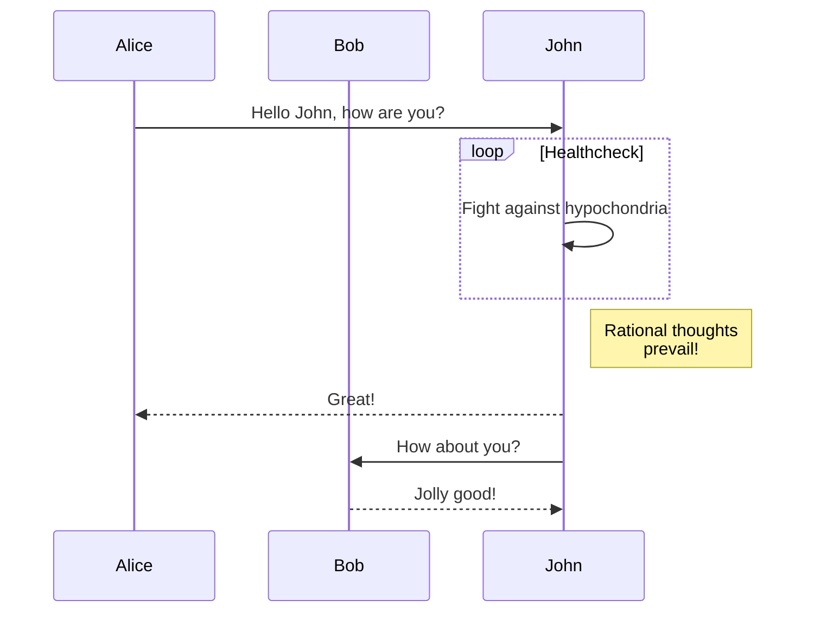

graph from https://github.blog/2022-02-14-include-diagrams-markdown-files-mermaid/

```mermaid
  graph TD;
      A-->B;
      A-->C;
      B-->D;
      C-->D;
```

graph from https://mermaid-js.github.io/mermaid/#/

```mermaid
sequenceDiagram
    participant Alice
    participant Bob
    Alice->>John: Hello John, how are you?
    loop Healthcheck
        John->>John: Fight against hypochondria
    end
    Note right of John: Rational thoughts <br/>prevail!
    John-->>Alice: Great!
    John->>Bob: How about you?
    Bob-->>John: Jolly good!
```
